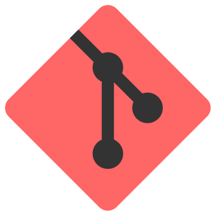

  

<h1 align="center">Yummy GitHistory</h1>

A fast, graphical Git history panel right inside VS Code.

---

Yummy GitHistory adds a dedicated **Git History** activity-bar container with three views — **Branches**, **History**, and **Changes** — so you can browse your repository's graph, inspect commits, and run everyday Git operations without leaving the editor.

## Features

- 📜 **Commit graph & history** — a virtualized, high-performance history view with the branch graph rendered inline.
- 🌿 **Branch management** — create, checkout, rename, delete, compare, push, pull, fetch, set upstream, and track remote branches.
- 🔀 **Integrate branches** — merge, rebase, checkout-and-rebase, and cherry-pick straight from the branches list.
- 📦 **Stash support** — stash, pop, apply, and drop changes.
- 🔍 **Filtering & search** — filter history by author or commit message, and locate a commit by its hash.
- 🗂️ **Changes view** — see the files touched by the selected commit and open diffs.
- 🧩 **Multi-repository** — switch between repositories and hide the ones you don't need.
- ⚙️ **Configurable columns** — toggle which columns appear in the history view.

## Getting started

1. Open a folder that is a Git repository.
2. Click the **Git History** icon in the activity bar.
3. Browse the **History** view, pick a branch from **Branches**, and inspect commit changes in **Changes**.

## Requirements

- VS Code `1.97.0` or newer.
- Git installed and available on your `PATH`.

## Commands

All commands are available under the **Git History** category (and via the view toolbars / context menus):

- Switch Branch / Ref, Switch Repository
- Filter by Author, Filter by Message, Locate Commit by Hash
- Branch actions: Create, Checkout, Merge, Rebase, Cherry-pick, Rename, Push, Pull, Fetch, Set Upstream, Delete, Compare with Current
- Stash: Stash Changes, Pop, Apply, Drop

## Contributing & issues

Found a bug or have a feature request? Please open an issue at
[github.com/yummyanime/yummy-githistory/issues](https://github.com/yummyanime/yummy-githistory/issues).

## License

Released under the [MIT License](LICENSE).
